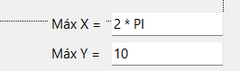

# Proyecto creado usando Windows Form y el lenguaje de programación C#

### Guía de instalación:

Instalar dotnet sdk 9.

### Guía de utilización:

Para utilizar la aplicación se debe ejecutar el archivo: RiemannIntegral.exe 
 
Ejecutar la aplicación como administrador 

### Condiciones que debe cumplir el programa para su correcta ejecución:

**1.** **_La función a graficar debe ser continua y positiva en el intervalo desde 0 a el valor definido por el usuario en la esquina inferior derecha de la pantalla._** 
 

**2.** **_Para graficar una función es necesario que la sintaxis de la expresión se ajuste a las especificaciones del lenguaje C#, esta se introduce en el cuadro de texto superior de la ventana_** 
 
**Operaciones más comunes** 
| Operaciones | Expreciones C#|
|--------------|---------------|
| Producto | * |
| Adición |+ |
| Exp: a^b |Pow(a,b) |
|Raíz cuadrada|Sqrt(x)|
|agrupamiento| ()|
|Seno|Sin(x)|

**Alguna otra operación se puede realizar si se encuentra disponible dentro de la clase Math de c#**

**3.** **_En la región inferior de la ventana se encuentran:_**  -**Un slider para variar la cantidad de particiones a realizar en tiempo real.**  -**La leyenda acerca de las áreas tomadas para cada una de las sumas de Darboux**  -**Los resultados aproximados de dichas sumas para la cantidad de particiones elegidas.** 

## Información Importante:

**Si el usuario desea cambiar la función graficada es necesario reiniciar la aplicación**

### Ejemplo de una Función

 